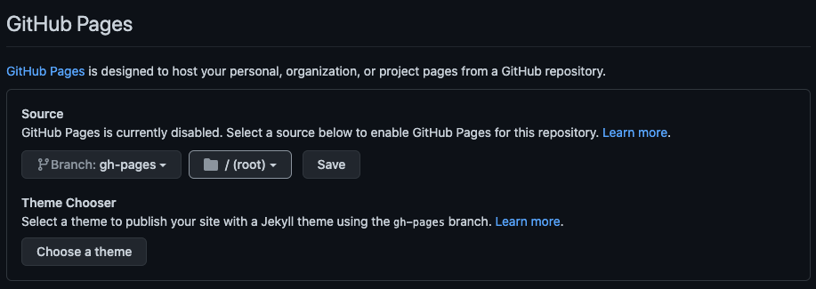
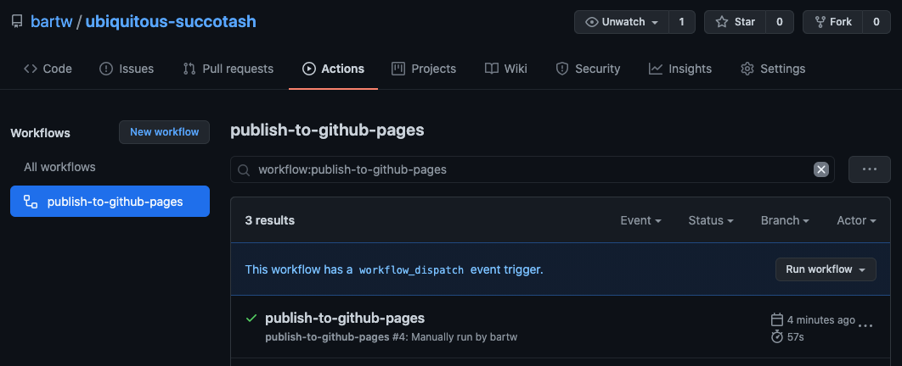

# Create, Automate and Document Your Own React Component Library From Scratch

In this story, I will take you along on my journey to create a React Component Library. Don't expect to write a bunch of components. I left that part out because it's too subjective. Instead, we will be using Storybook, Typescript, Jest, GitHub Pages, and a lot more to create a practically empty but almost production-ready Component Library.

- [x] Build ui components with [React](https://reactjs.org/)
- [x] Visual documentation with [Storybook](https://storybook.js.org/) on [GitHub Pages](https://pages.github.com/)
- Bundle code into a library using [rollup.js](https://rollupjs.org/)
- Verify code quality using:
  - [x] [TypeScript](https://www.typescriptlang.org/)
  - [x] [ESLint](https://eslint.org/)
  - [x] [Jest](https://jestjs.io/)
  - [x] [Testing Library](https://testing-library.com/)
  - [x] [Codecov](https://codecov.io/)
  - [x] [Prettier](https://prettier.io/)
- Streamline the release process using:
  - [x] [commitlint](https://commitlint.js.org/)
  - [x] [semantic-release](https://github.com/semantic-release/semantic-release)
  - [x] [GitHub Actions](https://github.com/features/actions)

## Why?

Because of reasons. No seriously, when your app, company, or never finished personal projects start to grow, you need to guard your style.

A Component Library can help you use consistent UI elements across your organization. A Component Library can provide the building blocks you need to develop new features.

But it can only work if you have a high-quality Component Library. Your Component Library needs to evolve without friction. Using and updating your Component Library has to be effortless.

So let's go and create a Component Library that will make you proud!

## Getting started

```shell
mkdir component-libary
cd component-library
git init
echo "node_modules" >> .gitignore
npm init -y
```

```shell
npm install -D typescript
touch tsconfig.json
```

```json
{
  "compilerOptions": {
    "target": "es5",
    "lib": ["dom", "dom.iterable", "esnext"],
    "allowJs": true,
    "skipLibCheck": true,
    "esModuleInterop": true,
    "allowSyntheticDefaultImports": true,
    "strict": true,
    "forceConsistentCasingInFileNames": true,
    "noFallthroughCasesInSwitch": true,
    "module": "esnext",
    "moduleResolution": "node",
    "resolveJsonModule": true,
    "isolatedModules": true,
    "noEmit": true,
    "jsx": "react-jsx"
  },
  "include": ["components"]
}
```

```shell
npm install react react-dom
npm install -D @types/react @types/react-dom
mkdir components components/title
touch components/title/Title.tsx
```

`components/title/Title.tsx`

```tsx
type Props = { children: React.ReactNode };

export const Title = ({ children }: Props) => <h1>{children}</h1>;
```

## Documentation

```shell
npx sb init
```

`package.json`

```json
"scripts": {
    "storybook": "start-storybook -p 6006",
    "build-storybook": "build-storybook"
}
```

```shell
npm run storybook
```

`.storybook/main.js`

```js
module.exports = {
  stories: [
    "../components/**/*.stories.mdx",
    "../components/**/*.stories.@(ts|tsx)",
  ],
  addons: ["@storybook/addon-links", "@storybook/addon-essentials"],
};
```

```shell
rm -rf stories
touch components/title/Title.stories.tsx
```

`components/title/Title.stories.tsx`

```tsx
import { Meta } from "@storybook/react/types-6-0";
import { Title } from "./Title";

export default {
  title: "Components/Title",
  component: Title,
} as Meta;

export const Primary = () => <Title>A Title</Title>;
```

```shell
npm run storybook
```

```shell
mkdir .github .github/workflows
touch .github/workflows/publish-to-github-pages.yml
```

```yml
name: publish-to-github-pages

on:
  workflow_dispatch:

  push:
    branches: [main]

jobs:
  build-and-deploy:
    runs-on: ubuntu-latest
    steps:
      - uses: actions/checkout@v2
      - uses: actions/setup-node@v1
        with:
          node-version: 14
      - run: npm ci
      - run: npm run build-storybook
      - uses: crazy-max/ghaction-github-pages@v2.2.0
        with:
          build_dir: "storybook-static"
          jekyll: false
        env:
          GITHUB_TOKEN: ${{ secrets.GITHUB_TOKEN }}
```

https://github.com/new

```shell
git add .
git commit -m"initial commit"
git remote add origin git@github.com:bartw/ubiquitous-succotash.git
git branch -M main
git push -u origin main
```

https://github.com/bartw/ubiquitous-succotash/settings





## Bundling

## Code quality

## CI/CD

## What's next?
